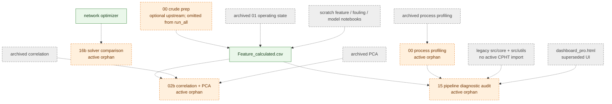
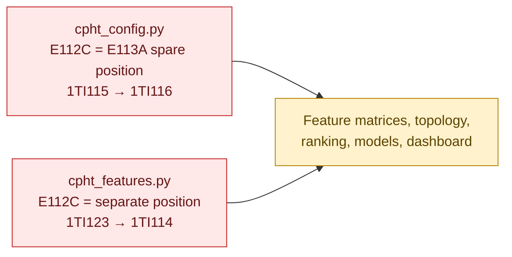
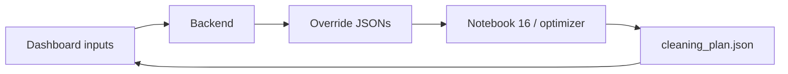
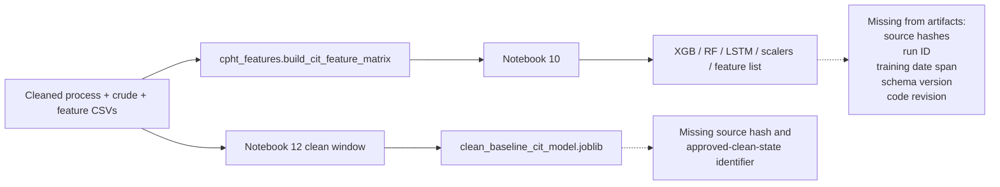

# Current CPHT Pipeline Graph

## Legend

- Solid arrow: confirmed by an actual file read/write, import, dashboard fetch, or orchestrator call.
- Dashed arrow: inferred, historical, optional, or not enforced by the active orchestrator.
- Red nodes: overwrite/mutation points or high-risk duplicate authority.
- Orange nodes: active orphan/diagnostic stages outside the main batch chain.
- Gray nodes: archived, obsolete, or unreferenced branches.
- Purple nodes: dashboard/runtime feedback.

## End-to-end flow

```mermaid
flowchart LR
    classDef raw fill:#eef6ff,stroke:#3973ac,color:#16324f
    classDef stage fill:#eaf7ea,stroke:#3d8b40,color:#153d18
    classDef calc fill:#fff7df,stroke:#c68a00,color:#513800
    classDef model fill:#f1eaff,stroke:#7451a6,color:#2f1854
    classDef dash fill:#e8f7f6,stroke:#16847e,color:#0c413e
    classDef risk fill:#ffe8e8,stroke:#c62828,color:#641515,stroke-width:2px
    classDef orphan fill:#fff0dd,stroke:#e67e22,color:#6f3300,stroke-dasharray: 5 3
    classDef obsolete fill:#eeeeee,stroke:#777,color:#444,stroke-dasharray: 5 3
    classDef runtime fill:#f4e8ff,stroke:#8e44ad,color:#4a1760,stroke-width:2px

    subgraph RAW["Raw data"]
        RP["Raw process historian Excel"]:::raw
        RC["Raw crude assay Excel"]:::raw
        RB["Bypass / cleaning-capability Excel"]:::raw
    end

    subgraph PREP["Data preparation"]
        N00C["00 crude assay prep"]:::orphan
        N00P["00 process profiling<br/>ORPHAN: EDA only"]:::orphan
        N01["01 data cleaning<br/>+ crude merge"]:::stage
        CRUDE["Crude_property_profiled.csv"]:::stage
        CLEAN["Process_information_cleaned.csv"]:::stage
        PWC["Process_information_with_crude.csv"]:::stage
    end

    RC --> N00C --> CRUDE
    RP --> N00P
    RP --> N01
    CRUDE --> N01
    N01 --> CLEAN
    N01 --> PWC

    subgraph FEATURES["Feature engineering"]
        N02["02 feature engineering"]:::stage
        FEAT["Feature_calculated.csv"]:::risk
        ROUGH["Fouling_Rate_By_Run.csv<br/>preliminary writer"]:::risk
        N03["03 operating-state classification"]:::stage
        STATE["Operating_State.csv"]:::stage
        RATE["compute_fouling_rate.py<br/>AUTHORITATIVE overwrite"]:::risk
    end

    PWC --> N02
    N02 --> FEAT
    N02 --> ROUGH
    FEAT --> N03 --> STATE
    FEAT --> RATE
    STATE --> RATE
    RATE -->|"overwrites"| FEAT
    RATE -->|"overwrites preliminary file"| ROUGH

    subgraph CALC["Calculations"]
        N04["04 Q / fouling-rate estimation"]:::calc
        FQ["Feature_Q.csv"]:::calc
        FRR["Fouling_Rate_Ranking.csv"]:::calc
        N05["05 Q-CIT sensitivity"]:::calc
        QCIT["Q_CIT_Sensitivity.csv"]:::calc
        N08["08 engineering priority"]:::calc
        ENG["Engineering_Priority_Score.csv"]:::calc
        LEGPRI["Cleaning_Priority_Ranking.csv<br/>duplicate priority lens"]:::risk
    end

    PWC --> N04
    STATE --> N04
    ROUGH --> N04
    N04 --> FQ
    N04 --> FRR
    PWC --> N05
    FQ --> N05
    FRR --> N05
    N05 --> QCIT
    FRR --> N08
    QCIT --> N08
    ROUGH --> N08
    N08 --> ENG
    N08 --> LEGPRI

    subgraph FORECAST["Fouling and CIT forecasting"]
        N06["06 fouling-rate forecast"]:::model
        DEVQ["Q_Deviation_Signal.csv"]:::model
        DEVT["Cold_Out_Deviation_Signal.csv"]:::model
        N07["07 time-to-clean"]:::model
        TTC["Time_To_Clean_Prediction.csv"]:::model
        N13["13 forecast/dashboard export"]:::model
        FC["forecast_6mo.json"]:::risk
        REC["cleaning_recommendations.json"]:::model
    end

    FEAT --> N06
    STATE --> N06
    FRR --> N06
    N06 --> DEVQ
    N06 --> DEVT
    DEVQ --> N07 --> TTC

    subgraph MODELING["CIT modeling"]
        N09["09 CIT feature/model matrix"]:::model
        P1["hx_Q_cleaning_priority.csv"]:::risk
        N10["10 model benchmark"]:::model
        MOD["XGB / RF / LSTM artifacts<br/>dataset hash not embedded"]:::risk
        METCSV["Model_Comparison_Metrics.csv"]:::model
        N11["11 SHAP importance"]:::model
        P2["hx_Q_cleaning_priority_v2.csv<br/>duplicate priority lens"]:::risk
        N12["12 clean-baseline delta-CIT"]:::model
        CBM["clean-baseline model + delta-CIT outputs"]:::risk
    end

    CLEAN --> N09
    N09 --> P1
    CLEAN --> N10
    CRUDE --> N10
    FEAT --> N10
    N10 --> MOD
    N10 --> METCSV
    MOD --> N11
    P1 --> N11
    ENG --> N11
    N11 --> P2
    CLEAN --> N12
    CRUDE --> N12
    FEAT --> N12
    N12 --> CBM

    TTC --> N13
    P2 --> N13
    METCSV --> N13
    CLEAN --> N13
    N13 --> FC
    N13 --> REC

    subgraph POST["Post-processing and duplicated writers"]
        HON["gen_honest_metrics.py"]:::risk
        METJSON["model_metrics.json<br/>NB13 then overwritten"]:::risk
        INT["add_forecast_intervals.py"]:::risk
        TOPO["build_dashboard_topology.py"]:::calc
        PFD["pfd_topology.json"]:::calc
        PHM["phm_analysis.py"]:::model
        PHMOUT["propagation / RUL / reliability / drivers JSON"]:::model
        HXTS["export_hx_timeseries.py"]:::calc
        EOR["export_end_of_run.py"]:::calc
        CH["export_cleaning_history.py"]:::calc
        ECON["export_economics.py"]:::calc
        LOGI["cleaning_logistics.py"]:::calc
        EVID["export_evidence.py"]:::calc
        ENGEXP["export_engineering_priority.py"]:::calc
    end

    N13 --> METJSON
    CLEAN --> HON
    CRUDE --> HON
    FEAT --> HON
    HON -->|"overwrites NB13 output"| METJSON
    DEVT --> INT
    FC --> INT
    INT -->|"mutates in place"| FC
    CLEAN --> TOPO --> PFD
    DEVT --> PHM
    TTC --> PHM
    ROUGH --> PHM
    CRUDE --> PHM
    PHM --> PHMOUT
    FEAT --> HXTS
    DEVQ --> HXTS
    CLEAN --> HXTS
    ROUGH --> HXTS
    FEAT --> EOR
    DEVQ --> EOR
    ROUGH --> EOR
    TTC --> EOR
    QCIT --> EOR
    FEAT --> CH
    CLEAN --> CH
    QCIT --> CH
    PFD --> ECON
    CH --> ECON
    REC --> ECON
    RB --> LOGI
    ENG --> ENGEXP
    HON --> EVID
    ECON --> EVID
    EOR --> EVID
    CH --> EVID
    PHMOUT --> EVID

    subgraph OPT["Optimization"]
        S1["cleaning_scheduler.py<br/>legacy schedule"]:::risk
        S2["cleaning_scheduler_network.py<br/>network schedule"]:::calc
        N16["16 integrated cleaning plan"]:::calc
        PLAN["cleaning_plan.json<br/>current integrated output"]:::calc
        SCHEDS["cleaning_schedule.json + v2.json<br/>duplicated schedule outputs"]:::risk
    end

    ECON --> S1
    CH --> S1
    LOGI --> S1
    S1 --> SCHEDS
    ECON --> S2
    CH --> S2
    LOGI --> S2
    PFD --> S2
    S2 --> SCHEDS
    ROUGH --> N16
    ECON --> N16
    LOGI --> N16
    ENGEXP --> N16
    EOR --> N16
    PFD --> N16
    S2 --> N16
    N16 --> PLAN

    subgraph DASHBOARD["Dashboard"]
        JSON["dashboard/data/*.json<br/>no common generation manifest"]:::dash
        UI["dashboard/index.html<br/>reads JSON; also recalculates<br/>fuel/economics in browser"]:::risk
        API["backend/server.py"]:::runtime
        USER["Operator inputs / uploads"]:::runtime
    end

    METJSON --> JSON
    FC --> JSON
    REC --> JSON
    PFD --> JSON
    PHMOUT --> JSON
    HXTS --> JSON
    EOR --> JSON
    CH --> JSON
    ECON --> JSON
    LOGI --> JSON
    EVID --> JSON
    ENGEXP --> JSON
    PLAN --> JSON
    SCHEDS --> JSON
    JSON --> UI
    USER --> API
    API -->|"quick upload writes cleaned intermediate"| CLEAN
    API -->|"full run"| N01
    API -->|"cost / CIT / FG overrides"| N16
    N16 --> PLAN
    PLAN --> UI
    UI -->|"recompute requests"| API
```

## Inferred, optional, and orphan dependencies

Dashed edges above are not active production dependencies. They show historical lineage, optional preparation, or diagnostic consumption.

## Configuration conflict

This conflict is confirmed from code and must be resolved before dependency refactoring.

## Circular-dependency assessment

No confirmed batch file cycle was found. The following interactive loop is intentional but should be treated as runtime state, not an analytical DAG:

## Models without complete training-data lineage

The producing notebooks and functions are traceable, but the exact dataset behind an existing binary artifact cannot be reconstructed from artifact metadata alone.

