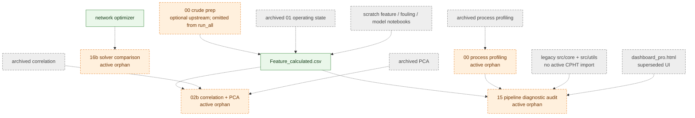
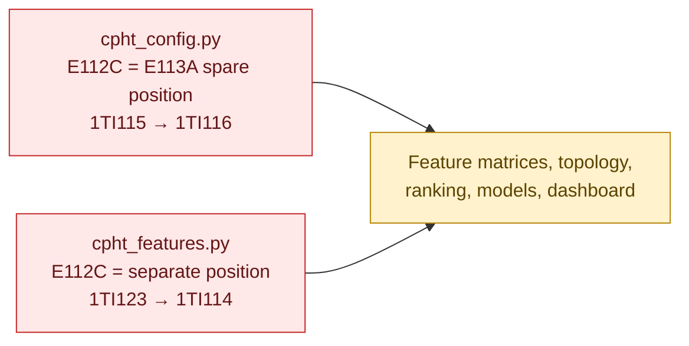
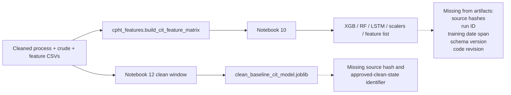

# Current CPHT Pipeline Dependency Map

**Status:** CURRENT

## Scope and interpretation

This document records the pipeline as implemented on 2026-07-16 (updated 2026-07-17 for the `notebooks/production/` reorg, and 2026-07-19 for moving 14-17 into `production/` and removing the `notebooks/*.py` compatibility shims — see `docs/archive/MIGRATION_MAP.md` for the full old->new path table). It is a current-state map, not a proposed architecture. It was derived from notebook cells, Python source, `pipeline/run_all.py`, dashboard fetch calls, and explicit file reads/writes.

- **Confirmed dependency**: an actual import, read, write, subprocess invocation, or dashboard fetch is present in code.
- **Inferred dependency**: historical intent, saved notebook output, naming, or documentation indicates a relationship, but the active code does not enforce it.
- **Reproducible** means reproducible only in the expected project environment with the external plant-data directory and required packages available. It does not mean the result has been independently validated.
- The detailed row-level record is in [NOTEBOOK_DEPENDENCY_MATRIX.csv](NOTEBOOK_DEPENDENCY_MATRIX.csv).
- The visual data-flow view is in [CURRENT_PIPELINE_GRAPH.md](CURRENT_PIPELINE_GRAPH.md).

## Executive summary

The active production chain is (this is the real `pipeline/run_all.py` `CHAIN`
run order, not the `production/` filenames' numeric prefixes — see the note
below and `docs/archive/MIGRATION_MAP.md` for why the two differ):

1. `notebooks/production/01_data_quality.ipynb` (was `01_data_cleaning.ipynb`)
2. `notebooks/production/02_hx_performance_operating_modes.ipynb` — merged 2026-07-19 from
   `03_hx_performance.ipynb` (was `02_feature_engineering.ipynb`) + `02_operating_modes.ipynb`
   (was `03_operating_state_classification.ipynb`), in that cell order (hx-performance genuinely
   runs first; see the note below)
3. `pipeline/compute_fouling_rate.py`
4. `notebooks/production/05_fouling_analysis.ipynb` (was `04_fouling_rate_estimation.ipynb`)
5. `notebooks/production/09_cit_furnace_impact.ipynb` (was `05_fouling_cit_sensitivity.ipynb`)
6. `notebooks/production/04_clean_baseline.ipynb` (was `06_fouling_rate_forecast.ipynb`)
7. `notebooks/production/07_forecasting.ipynb` (was `07_time_to_clean_prediction.ipynb`)
8. `notebooks/production/08_cleaning_priority.ipynb` (was `08_cleaning_priority_ranking.ipynb`)
9. `notebooks/production/14_cit_model_feature_matrix.ipynb` — merged 2026-07-19 from the former
   `14_cit_model_feature_matrix.ipynb` + `15_cit_model_benchmark.ipynb` + `16_cit_shap_importance.ipynb`
   (all three moved into `production/` from the `notebooks/` root earlier the same day, then
   merged into one 3-part file since they ran back-to-back in `CHAIN` with nothing in between —
   reference, not canonical; 15's own finding: ML loses to a persistence baseline)
10. `notebooks/production/10_economic_evaluation.ipynb` (was `12_economic_delta_cit.ipynb`)
11. `notebooks/production/12_cit_forecast_export.ipynb` (was `13_cit_forecast_export.ipynb`)
12. A post-processing chain that creates the dashboard JSON artifacts, including
    `notebooks/production/13_cleaning_plan_optimization.ipynb` (was
    `16_cleaning_plan_optimization.ipynb`) and
    `notebooks/production/17_tam_constraint_analysis.ipynb` (moved into
    `production/` 2026-07-19).

**Note on numbering:** the merged `02_hx_performance_operating_modes.ipynb` runs
hx-performance cells *before* operating-modes cells — the real code dependency
(operating-state resolution reads the feature table hx-performance produces)
is the reverse of the two old filenames' conceptual stage order. That long-standing
mismatch (see `docs/archive/MIGRATION_MAP.md`) is now resolved by the merge itself:
one file, cells in true execution order, no numbering to reconcile. The merged
`14_cit_model_feature_matrix.ipynb`'s number still reflects *when* it was moved
into `production/`, not its position in the real run order (see the `CHAIN` list above).

The chain is not a clean directed acyclic data pipeline:

- ~~Notebook 02 writes a preliminary `Fouling_Rate_By_Run.csv`, which `compute_fouling_rate.py` later overwrites.~~ Resolved (Phase 1 item A1): notebook 02 no longer writes this file; `compute_fouling_rate.py` is the sole writer.
- `compute_fouling_rate.py` still patches `Feature_calculated.csv` in place (an upstream feature table notebook 02 also writes) — this is a genuine intermediate-reader case (notebook 03 reads notebook 02's uncorrected version to build `Operating_State.csv`, which the correction itself depends on), so the file can't have a single writer. Mitigated instead with a `fouling_baseline_corrected` lineage column (Phase 1 item A2) so a reader can tell which version they have.
- Notebook 13 writes `model_metrics.json`; `gen_honest_metrics.py` overwrites it.
- Notebook 13 writes `forecast_6mo.json`; `add_forecast_intervals.py` mutates it.
- The backend can execute notebook 16 in place and rewrite dashboard override/output files.
- The dashboard performs additional economic and furnace calculations in browser code instead of only displaying approved tables.

No true file-level circular dependency was confirmed in the batch chain. There is, however, a **runtime feedback loop**:

`dashboard inputs → backend override JSON → notebook 16/network optimizer → cleaning_plan.json → dashboard`.

## Onboarding: how to run, and a reading order

*(Merged in from the former `ANALYSIS_PIPELINE_GUIDE.md`, updated to current `notebooks/production/` filenames — see git log commit `d9498e3` for the renumbering.)*

Run the whole pipeline, or resume/target part of it:

```
python pipeline/run_all.py                  # rerun everything against current data
python pipeline/run_all.py --input new.xlsx  # swap the raw input file first
python pipeline/run_all.py --only 13         # rerun just one stage (fast, for post-processing tweaks)
python pipeline/run_all.py --from 05         # resume from a mid-pipeline stage
```

`pipeline/run_all.py`'s `CHAIN` constant is the ground truth for run order (see the Executive summary chain above); everything auto-backs-up to `Data/backup_<timestamp>/` before running.

If you're new to this project, read notebooks in this conceptual order (grouped by the question each stage answers, not exactly the run order — the Executive summary above has the real run order):

**prepare data → compute features/fouling → rank by priority → forecast → CIT model (3 parallel angles) → economics/site constraints → integrated cleaning plan**

| Group | Notebooks | Answers |
|---|---|---|
| Prepare data | `01_data_quality.ipynb`, EDA crude/process notebooks | Is the raw data usable? What's missing or out-of-range? |
| Features/fouling | `02_hx_performance_operating_modes.ipynb`, `pipeline/compute_fouling_rate.py` | Q/ΔT/U per HX; which shell is actually active each day; authoritative fouling rate |
| Ranking | `05_fouling_analysis.ipynb`, `08_cleaning_priority.ipynb` | Which HX fouls fastest, matters most to CIT, and is worth cleaning first |
| Forecast | `04_clean_baseline.ipynb`, `07_forecasting.ipynb` | How many days until each HX needs cleaning |
| CIT modeling | `14_cit_model_feature_matrix.ipynb` (3-part merged file: feature matrix + benchmark + SHAP), `09_cit_furnace_impact.ipynb` | Can CIT be forecast (answer: not beyond a persistence baseline — see `[[project_cit_persistence_finding]]`), and which HX drives it |
| Economics/constraints | `10_economic_evaluation.ipynb`, `17_tam_constraint_analysis.ipynb` | What's a real cleaning worth, and what does the plant's real bypass capability allow |
| Integrated plan | `13_cleaning_plan_optimization.ipynb` | The one recommended cleaning schedule, combining all of the above |

### Dashboard tab → pipeline stage

| Dashboard tab | Sourced from | Answers |
|---|---|---|
| ภาพรวม & P&ID (Overview) | `13_cleaning_plan_optimization.ipynb`, `08_cleaning_priority.ipynb`, topology exporter | Plant status now — what needs attention first |
| HX รายตัว (per-HX detail) | `export_hx_timeseries.py`, `export_end_of_run.py`, `export_cleaning_history.py` | Raw history/reliability of one selected HX |
| เตา & Optimization (Furnace) | `13_cleaning_plan_optimization.ipynb`, `export_economics.py`, `08_cleaning_priority.ipynb` | Furnace impact of fouling; is running below-spec worth it |
| แผนล้าง HX (Cleaning plan) | `13_cleaning_plan_optimization.ipynb`, `cleaning_logistics.py`, `17_tam_constraint_analysis.ipynb` | What to clean, when, under real constraints |
| พยากรณ์ & ความเสี่ยง (Forecast/risk) | `pipeline/phm_analysis.py` | Days remaining before each HX needs cleaning, and what's driving it |
| โมเดล & Optimization (Model card) | `pipeline/gen_honest_metrics.py`, `14_cit_model_feature_matrix.ipynb` Part 2 | How much to trust the model, plus a re-run trigger |
| หลักฐาน & ความเชื่อมั่น (Evidence) | `pipeline/export_evidence.py` | What's measured vs. modeled vs. assumed, and every caveat |

## Data locations

### External raw and processed data

Most plant data is outside the repository:

`C:\Desktop\Bangchak Internship 2026\Data`

The path is resolved consistently through `CPHT_DATA_DIR` (with the plant Windows location as a local default). Important external inputs include:

- Raw process historian Excel
- Raw crude assay Excel
- Bypass/cleaning-capability Excel
- Cleaned and feature CSVs produced by notebooks

### Repository outputs

- `outputs/*.csv`: model/ranking/economic outputs from notebooks 09–13.
- `models/*`: XGBoost, Random Forest, LSTM, scaler, feature-list, and clean-baseline artifacts.
- `dashboard/data/*.json`: live dashboard interface.
- `figures/**`: generated analytical plots.
- `dashboard/data/backup_*`: timestamped output snapshots.

The active pipeline uses CSV rather than Parquet for processed analytical data.

## Stage map

| Stage | Producers | Primary outputs | Primary consumers |
|---|---|---|---|
| Raw profiling | Notebooks 00 process and 00 crude | Crude profile CSV; figures | Notebook 01; human review |
| Cleaning and assay merge | Notebook 01 | Cleaned process, process-with-crude, DQ score | Notebooks 02–05, model feature builder, exporters |
| Feature engineering | Notebook 02 | Feature table; preliminary run rates | Notebook 03; rate recomputation; correlation/PCA; PHM/exporters |
| Operating-state resolution | Notebook 03 | `Operating_State.csv` | Authoritative rate computation; notebooks 04 and 06 |
| Authoritative fouling calculation | `compute_fouling_rate.py` | Mutated feature table; authoritative run-rate table | Notebooks 04, 06–08, PHM, economics, optimization |
| Q/fouling calculations | Notebooks 04–05 | Feature Q, rate ranking, Q–CIT sensitivity | Notebooks 06–08; end-of-run/economics |
| Fouling forecasting | Notebooks 06–07 | Deviation signals; time-to-clean | Notebook 08; notebook 13; PHM; end-of-run |
| Engineering priority | Notebook 08 | Engineering and legacy priority CSVs | Engineering-priority exporter; notebook 16 |
| CIT modeling | Notebooks 09–11 | Priority tables; models; metrics; SHAP ranking | Notebooks 12–13; honest-metrics exporter |
| Economic delta-CIT | Notebook 12 | Clean-baseline model; delta-CIT tables; sandbox JSON | Economics/dashboard; diagnostic notebook |
| Forecast/dashboard export | Notebook 13 | Core dashboard JSONs; recommendation CSV | Dashboard; post-processors |
| PHM and evidence | Pipeline exporters | RUL, reliability, drivers, history, evidence | Dashboard; optimization |
| Optimization | Schedulers and notebook 16 | Schedule and integrated plan JSONs | Dashboard |

## Explicit notebook contracts

The current notebooks generally expose contracts through file I/O, but not all have a formal schema. No notebook uses another notebook's live Python variables as its intended interface. Their interface is disk files. This satisfies the no-memory-interface rule in intent, with these caveats:

- Notebook 09 duplicates feature-building logic later centralized in `cpht_features.py`.
- Saved output cells can make a notebook appear complete even when an upstream file has changed.
- Notebook execution in place means notebook files contain generated execution state.
- Notebook 16 may be regenerated from `scripts/_build_cleaning_plan_notebook.py`, creating two editable sources.

## Schema validation

Schema validation is incomplete:

- `backend/server.py` validates required uploaded tags and raw Excel shape.
- `tests/test_dashboard_schema.py` checks selected keys in a few outputs.
- Some notebooks perform assertions or plausibility checks.
- Most CSV and JSON outputs have no versioned schema or manifest.
- Tests skip when local artifacts are absent.
- No single run ID, source hash, schema version, or freshness manifest ties all dashboard artifacts together.

## Overwrites and duplicate outputs

| Output | First writer | Later writer/mutator | Risk |
|---|---|---|---|
| `Fouling_Rate_By_Run.csv` | `compute_fouling_rate.py` (sole writer as of Phase 1 item A1) | n/a | Resolved |
| `Feature_calculated.csv` | Notebook 02 | `compute_fouling_rate.py` | Intentional (see above); `fouling_baseline_corrected` column added Phase 1 item A2 so the two versions are distinguishable |
| `model_metrics.json` | ~~Notebook 13~~ `gen_honest_metrics.py` (sole writer as of Phase 1 item A3) | n/a | Resolved: notebook 13 no longer writes this file at all |
| `forecast_6mo.json` | Notebook 13 (interval logic folded in, Phase 1 item A4) | n/a | Resolved: `add_forecast_intervals.py` is superseded and no longer invoked by `run_all.py` |
| `cleaning_plan.json` | Notebook 16 | Notebook 16 via backend recomputation | Both writes execute the same notebook with different override JSON inputs. Executed copies are written to `reports/executed_notebooks/`; the source notebook is not modified in place. |
| Override JSONs | Dashboard/backend | Backend deletes or rewrites them | Runtime state is mixed with approved analytical outputs |

Duplicated or competing outputs include:

- `Cleaning_Priority_Ranking.csv`
- `Engineering_Priority_Score.csv`
- `hx_cleaning_priority.csv`
- `hx_Q_cleaning_priority.csv`
- `hx_Q_cleaning_priority_v2.csv`
- `hx_ranking.json`
- `engineering_priority.json`
- `cleaning_schedule.json`
- `cleaning_schedule_v2.json`
- `cleaning_plan.json`

These are not identical schemas and answer different variants of “what should be cleaned first,” but the distinction is not enforced by a central data contract.

## Orphans and obsolete branches

### Active but outside the production chain

- `notebooks/eda/crude_assay_exploration.ipynb` (moved 2026-07-17, was `_eda_crude_assay.ipynb`, originally `00_data_prep_crude_assay.ipynb`, Phase 1): required when the crude profile must be rebuilt, but absent from `run_all.py`.
- `notebooks/eda/process_control_exploration.ipynb` (moved 2026-07-17, was `_eda_process_control.ipynb`, originally `00_data_prep_process_control.ipynb`): EDA only.
- `notebooks/eda/correlation_and_pca.ipynb` (moved 2026-07-17, was `_eda_correlation_and_pca.ipynb`, originally `02b_correlation_and_pca.ipynb`): exploratory analysis only.
- `15_pipeline_diagnostic_audit.ipynb`: diagnostic consumer only.
- `notebooks/diagnostics/solver_comparison.ipynb` (moved 2026-07-17, was `_diagnostic_solver_comparison.ipynb`, originally `16b_optimizer_solver_comparison.ipynb`): offline optimizer verification.

### Archived or obsolete notebooks

- `_archive_2026-07-12/01_case_operate_state.ipynb`
- `_archive_2026-07-12/2_correlation.ipynb`
- `_archive_2026-07-12/2_pca.ipynb`
- `_archive_2026-07-12/test_output.ipynb`
- `_archive_2026-07-12/scratch_fouling/test_features.ipynb`
- `_archive_2026-07-12/scratch_fouling/test_fouling.ipynb`
- `_archive_2026-07-12/scratch_fouling/test_models.ipynb`

They are not called by `run_all.py` or active pipeline scripts.

### Legacy Python branch

`src/archive/core*.py` and `src/archive/utils/*.py` (archived 2026-07-17, were `src/core*.py`/`src/utils/*.py`) form an older generic furnace-ML framework. No active CPHT notebook or pipeline script imports them. Current reusable CPHT logic resides in `src/domain`, `src/features`, `src/models`, `src/optimization`, `src/reporting`, `src/validation` (moved 2026-07-17 from `notebooks/*.py`; the one-line backward-compat shims left at the old `notebooks/*.py` paths were removed 2026-07-19 once every notebook's import cells were updated to import `src.*` directly — see `docs/archive/MIGRATION_MAP.md`).

## Dashboard dependency boundary

The dashboard reads `dashboard/data/*.json`; it does not directly fetch the external CSVs or Excel files. However:

- `dashboard/index.html` calculates CIT deficit, fuel-gas reduction, CO2, payback, and cumulative economics in browser code.
- It contains hard-coded engineering/economic defaults.
- `backend/server.py` reads uploaded raw or cleaned data and writes intermediate/runtime files.
- The “quick update” endpoint refreshes topology/furnace data only, so the dashboard can combine a new topology with old rankings and forecasts.

Therefore, the browser does not read raw plant data directly, but the dashboard application is not a pure approved-output renderer.

## Model traceability

| Artifact | Training producer | Training input traceability | Active use |
|---|---|---|---|
| `xgb_cit_model.joblib` | Notebook 10 | Traceable to `cpht_features.build_cit_feature_matrix`, but no embedded dataset hash/run ID | SHAP and diagnostic use |
| `rf_cit_model.joblib` | Notebook 10 | Same limitation | SHAP cross-check |
| `lstm_cit_model.keras` | Notebook 10 | Same limitation; scaler artifact is separate | Permutation-importance cross-check |
| `lstm_scalers.joblib` | Notebook 10 | No source-data fingerprint | Notebook 11 |
| `feature_columns.joblib` | Notebook 10 | Feature names only, no schema version | Notebook 11 and diagnostic notebook |
| `clean_baseline_cit_model.joblib` | Notebook 12 | Clean-window assumptions recorded in code, no source hash | Counterfactual sandbox/economic support |

The model-producing notebooks can be identified, but the exact historical dataset used for an existing binary artifact cannot be proven from the artifact alone.

## Reproducibility assessment

The pipeline is conditionally reproducible, not fully reproducible:

- Positive: notebooks pass data through files rather than hidden memory; dependencies are pinned; orchestration order exists; baselines and some physical checks exist.
- Negative: external data is not versioned with outputs; notebook execution mutates notebooks; post-processors overwrite earlier outputs; processed data is CSV; no atomic publish; some paths are hard-coded; full dependencies are not installed in the default Docker image; active model artifacts lack lineage metadata.

## Current-state conclusions

1. The authoritative fouling-rate step is `pipeline/compute_fouling_rate.py`, not the preliminary rate section in notebook 02.
2. The active dashboard ranking source for engineering priority is `engineering_priority.json`; the integrated cleaning plan is `cleaning_plan.json`.
3. Notebook 13 is a core exporter but does not produce the final authoritative model-metrics or forecast schema by itself.
4. The batch pipeline has no confirmed circular file dependency, but the interactive dashboard creates a controlled feedback loop.
5. The most serious unresolved dependency conflict is the duplicate E112C topology in `cpht_config.py` and `cpht_features.py`.

## Ranking/score traceability (Phase 2, added 2026-07-17)

There is exactly **one** independent computation of HX cleaning-priority
ranking in the active pipeline. Every other ranking-shaped file is a
passthrough or a superseded prototype, not a second independent method —
this table exists so that question doesn't need to be re-derived by reading
code every time.

| File | Producer | Independent computation or passthrough? | Status |
|---|---|---|---|
| `Data/Engineering_Priority_Score.csv` | Notebook 08 §4, `engineering_priority_score = rank_norm(probability_score * consequence_score / effort_penalty)` | **Independent — the only real computation** | Authoritative |
| `dashboard/data/engineering_priority.json` | `pipeline/export_engineering_priority.py` | Passthrough of `Engineering_Priority_Score.csv` + `priority_rank` | Authoritative (primary dashboard/optimizer ranking source) |
| `outputs/hx_Q_cleaning_priority_v2.csv` | Notebook 11 §17 | Passthrough (`priority_v2['priority_score'] = engineering_priority_score`), adds `cit_shap_importance` as an extra informational column only | Reference (SHAP attribution), not an alternate ranking |
| `dashboard/data/hx_ranking.json` | Notebook 13 §5, from `hx_Q_cleaning_priority_v2.csv` | Passthrough of the same score, two hops removed from notebook 08 | Should always equal `engineering_priority.json`'s values for the same pipeline run — see `pipeline/export_engineering_priority.py`'s consistency check (Phase 2 Part F) for what happens when a partial rerun breaks that |
| `dashboard/data/cleaning_plan.json` | Notebook 16 §10 | Passthrough of `engineering_priority.json`'s score as primary sort key; notebook 16's own `priority_score`/`risk_mult` (net-saving × risk multiplier) is a **secondary tie-breaker and SLSQP scheduler input only**, never a replacement rank | Authoritative (cleaning-plan tab) |
| `outputs/hx_cleaning_priority.csv` (v1) | Original `14_cit_model_feature_matrix.ipynb` prototype | Independent, but superseded — naive equal-weight blend, documented as producing wrong results (e.g. E113A undersold, E101AB overstated) | Superseded; only used by `15_pipeline_diagnostic_audit.ipynb` for a v1-vs-v2 comparison plot, not consumed by the dashboard or notebook 16 |

**Practical rule:** if you need to know "is this the real ranking number,"
trace it back through this table to `Engineering_Priority_Score.csv` — if a
file isn't in this table's chain, it isn't part of the authoritative
ranking.

## Appendix: known per-file issues

*(Merged in from the former `NOTEBOOK_DEPENDENCY_MATRIX.csv`, drawn 2026-07-12 — before the `notebooks/production/` rename. Filenames below are pre-rename; cross-reference against the Executive summary chain for current names. The full 13-column audit, including per-file schema/reproducibility/confirmed-vs-inferred detail, is preserved in git history.)*

| File (pre-rename) | Known issue | Recommended action |
|---|---|---|
| `01_data_cleaning.ipynb` | Centered rolling corrections can use future observations; CSV not Parquet; hard-coded raw filename | Refactor into immutable ingestion plus tested cleaning functions |
| `02_feature_engineering.ipynb` | Preliminary rate shares filename with authoritative rate; `Q_norm` interpretation not approved; too many analytical questions in one notebook | Split feature calculation from event detection and fouling-rate estimation |
| `02b_correlation_and_pca.ipynb` | Combines two business questions; may read pre- or post-overwrite feature table | Split correlation and PCA; record input generation ID |
| `03_operating_state_classification.ipynb` | Critical inferred values (E101G, shell state) are not represented in a versioned provenance schema; output path hard-coded | Refactor state inference into `src/` and label measured/inferred fields |
| `pipeline/compute_fouling_rate.py` | Mutates upstream feature table in place; `CLEAN_WINDOW_DAYS` duplicated; non-atomic overwrite | Integrate into a single feature pipeline and publish a new versioned table |
| `04_fouling_rate_estimation.ipynb` | `Q_norm` treated as fouling evidence before formula approval; overlaps NB02 calculations | Refactor after `Q_norm` definition is approved |
| `05_fouling_cit_sensitivity.ipynb` | Same-timestamp serial-train association can be mistaken for causal/forecast sensitivity | Refactor with explicit estimand, lag policy, and time-aware validation |
| `06_fouling_rate_forecast.ipynb` | Pooled-HX generalization is weak; exact target horizon needs clarification | Refactor into tested forecasting module with explicit forecast horizon |
| `07_time_to_clean_prediction.ipynb` | Deterministic extrapolation; uncertainty added elsewhere; fixed thresholds | Refactor with uncertainty in the same output contract |
| `08_cleaning_priority_ranking.ipynb` | Multiple ranking definitions and embedded weights; duplicates other priority products | Split engineering risk ranking from legacy/action presentation |
| `14_cit_model_feature_matrix.ipynb` | Duplicates shared feature builder; purpose mixes feature construction and modeling; target timing unclear | Merge feature construction into `src/` and reduce notebook to one question |
| `14_cit_model_feature_matrix.ipynb` Part 2 (was `15_cit_model_benchmark.ipynb`) | Artifacts lack source hashes/run IDs; saved models fail to beat persistence for forecasting | Keep benchmark; mark artifacts attribution-only unless approved |
| `14_cit_model_feature_matrix.ipynb` Part 3 (was `16_cit_shap_importance.ipynb`) | Explains models that do not beat persistence; SHAP may be misread as causal cleaning gain | Refactor labels and separate attribution from decision ranking |
| `12_economic_delta_cit.ipynb` | Post-TAM used as clean reference; counterfactual independence and leakage risk | Refactor only after clean-baseline acceptance criteria are confirmed |
| `13_cit_forecast_export.ipynb` | 182-day linear forecast; `model_metrics`/`forecast` are overwritten/mutated later; can publish mixed freshness | Refactor as pure exporter from approved versioned tables |
| `17_tam_constraint_analysis.ipynb` | Whole-train TAM effects cannot be attributed to one HX; no formal notebook contract | Refactor outputs and confidence labels |
| `16_cleaning_plan_optimization.ipynb` | Default CIT deficit and economics embedded; partner-rate inheritance; builder script duplicates notebook source | Refactor into an `src/` service and make the notebook a transparent report |
| `pipeline/run_all.py` | Hard-coded Data path ignores `CPHT_DATA_DIR`; mutates raw expected path; mixed stale/fresh outputs possible | Refactor to immutable run directory plus atomic publish manifest |
| `build_dashboard_topology.py` | Conflicting HX configs; assumed bands/limits; current-state output can be newer than rankings | Refactor to one approved engineering configuration and generation ID |
| `pipeline/phm_analysis.py` | Four analytical questions in one script; driver causality risk; configuration in Python | Split into propagation, RUL, reliability, and driver modules |
| `pipeline/export_economics.py` | Assumed costs/constants; model gain calibration; browser duplicates formulas | Refactor to approved config and a single economic-calculation service |
| `pipeline/cleaning_scheduler.py` (v1) | Competes with the network and integrated plans | Archive once confirmed no longer authoritative (still feeds notebook 8's v1-vs-v2 comparison) |
| `pipeline/cleaning_scheduler_network.py` (v2) | SLSQP relaxation/rounding; some engineering limits assumed; runtime feedback loop with the dashboard | Refactor into a tested optimizer service with approved config |
| `backend/server.py` | No authentication; quick refresh can mix new topology with stale analytics; executes notebooks in place | Separate upload staging, analysis runs, and approved publication |
| `cpht_config.py` / `cpht_features.py` | Two conflicting E112C topology definitions (see Configuration conflict diagram below) | Resolve topology into one source of truth |
| `scripts/_build_cleaning_plan_notebook.py` | Two editable sources for notebook 16 (the builder and the notebook itself) | Choose one source of truth; archive the builder after confirmation |
| `src/core*.py`, `src/utils/*.py` | Not used by the current CPHT pipeline; missing/ambiguous dependencies | Do not delete without approval; classify for archive (already moved to `src/archive/`) |
| `dashboard/dashboard_pro.html` | Superseded prototype; conflicting CIT target and duplicate UI | Archive after approval (already unreferenced by the live dashboard) |

## Appendix: dependency diagrams

*(Merged in from the former `CURRENT_PIPELINE_GRAPH.md`, drawn 2026-07-12 — before the
`notebooks/production/` rename in commit `d9498e3`.)* **Node labels below use the
pre-rename numbering** (e.g. "02 feature engineering" = current
`notebooks/production/03_hx_performance.ipynb`; "01 data cleaning" = current
`notebooks/production/01_data_quality.ipynb`). Cross-reference against the Executive
summary chain at the top of this document for current filenames — the data-flow
shape and overwrite/risk annotations are still accurate, only the notebook names
changed.

### Legend

- Solid arrow: confirmed by an actual file read/write, import, dashboard fetch, or orchestrator call.
- Dashed arrow: inferred, historical, optional, or not enforced by the active orchestrator.
- Red nodes: overwrite/mutation points or high-risk duplicate authority.
- Orange nodes: active orphan/diagnostic stages outside the main batch chain.
- Gray nodes: archived, obsolete, or unreferenced branches.
- Purple nodes: dashboard/runtime feedback.

### End-to-end flow

```mermaid
flowchart LR
    classDef raw fill:#eef6ff,stroke:#3973ac,color:#16324f
    classDef stage fill:#eaf7ea,stroke:#3d8b40,color:#153d18
    classDef calc fill:#fff7df,stroke:#c68a00,color:#513800
    classDef model fill:#f1eaff,stroke:#7451a6,color:#2f1854
    classDef dash fill:#e8f7f6,stroke:#16847e,color:#0c413e
    classDef risk fill:#ffe8e8,stroke:#c62828,color:#641515,stroke-width:2px
    classDef orphan fill:#fff0dd,stroke:#e67e22,color:#6f3300,stroke-dasharray: 5 3
    classDef obsolete fill:#eeeeee,stroke:#777,color:#444,stroke-dasharray: 5 3
    classDef runtime fill:#f4e8ff,stroke:#8e44ad,color:#4a1760,stroke-width:2px

    subgraph RAW["Raw data"]
        RP["Raw process historian Excel"]:::raw
        RC["Raw crude assay Excel"]:::raw
        RB["Bypass / cleaning-capability Excel"]:::raw
    end

    subgraph PREP["Data preparation"]
        N00C["00 crude assay prep"]:::orphan
        N00P["00 process profiling<br/>ORPHAN: EDA only"]:::orphan
        N01["01 data cleaning<br/>+ crude merge"]:::stage
        CRUDE["Crude_property_profiled.csv"]:::stage
        CLEAN["Process_information_cleaned.csv"]:::stage
        PWC["Process_information_with_crude.csv"]:::stage
    end

    RC --> N00C --> CRUDE
    RP --> N00P
    RP --> N01
    CRUDE --> N01
    N01 --> CLEAN
    N01 --> PWC

    subgraph FEATURES["Feature engineering"]
        N02["02 feature engineering"]:::stage
        FEAT["Feature_calculated.csv"]:::risk
        ROUGH["Fouling_Rate_By_Run.csv<br/>preliminary writer"]:::risk
        N03["03 operating-state classification"]:::stage
        STATE["Operating_State.csv"]:::stage
        RATE["compute_fouling_rate.py<br/>AUTHORITATIVE overwrite"]:::risk
    end

    PWC --> N02
    N02 --> FEAT
    N02 --> ROUGH
    FEAT --> N03 --> STATE
    FEAT --> RATE
    STATE --> RATE
    RATE -->|"overwrites"| FEAT
    RATE -->|"overwrites preliminary file"| ROUGH

    subgraph CALC["Calculations"]
        N04["04 Q / fouling-rate estimation"]:::calc
        FQ["Feature_Q.csv"]:::calc
        FRR["Fouling_Rate_Ranking.csv"]:::calc
        N05["05 Q-CIT sensitivity"]:::calc
        QCIT["Q_CIT_Sensitivity.csv"]:::calc
        N08["08 engineering priority"]:::calc
        ENG["Engineering_Priority_Score.csv"]:::calc
        LEGPRI["Cleaning_Priority_Ranking.csv<br/>duplicate priority lens"]:::risk
    end

    PWC --> N04
    STATE --> N04
    ROUGH --> N04
    N04 --> FQ
    N04 --> FRR
    PWC --> N05
    FQ --> N05
    FRR --> N05
    N05 --> QCIT
    FRR --> N08
    QCIT --> N08
    ROUGH --> N08
    N08 --> ENG
    N08 --> LEGPRI

    subgraph FORECAST["Fouling and CIT forecasting"]
        N06["06 fouling-rate forecast"]:::model
        DEVQ["Q_Deviation_Signal.csv"]:::model
        DEVT["Cold_Out_Deviation_Signal.csv"]:::model
        N07["07 time-to-clean"]:::model
        TTC["Time_To_Clean_Prediction.csv"]:::model
        N13["13 forecast/dashboard export"]:::model
        FC["forecast_6mo.json"]:::risk
        REC["cleaning_recommendations.json"]:::model
    end

    FEAT --> N06
    STATE --> N06
    FRR --> N06
    N06 --> DEVQ
    N06 --> DEVT
    DEVQ --> N07 --> TTC

    subgraph MODELING["CIT modeling"]
        N09["09 CIT feature/model matrix"]:::model
        P1["hx_Q_cleaning_priority.csv"]:::risk
        N10["10 model benchmark"]:::model
        MOD["XGB / RF / LSTM artifacts<br/>dataset hash not embedded"]:::risk
        METCSV["Model_Comparison_Metrics.csv"]:::model
        N11["11 SHAP importance"]:::model
        P2["hx_Q_cleaning_priority_v2.csv<br/>duplicate priority lens"]:::risk
        N12["12 clean-baseline delta-CIT"]:::model
        CBM["clean-baseline model + delta-CIT outputs"]:::risk
    end

    CLEAN --> N09
    N09 --> P1
    CLEAN --> N10
    CRUDE --> N10
    FEAT --> N10
    N10 --> MOD
    N10 --> METCSV
    MOD --> N11
    P1 --> N11
    ENG --> N11
    N11 --> P2
    CLEAN --> N12
    CRUDE --> N12
    FEAT --> N12
    N12 --> CBM

    TTC --> N13
    P2 --> N13
    METCSV --> N13
    CLEAN --> N13
    N13 --> FC
    N13 --> REC

    subgraph POST["Post-processing and duplicated writers"]
        HON["gen_honest_metrics.py"]:::risk
        METJSON["model_metrics.json<br/>NB13 then overwritten"]:::risk
        INT["add_forecast_intervals.py"]:::risk
        TOPO["build_dashboard_topology.py"]:::calc
        PFD["pfd_topology.json"]:::calc
        PHM["phm_analysis.py"]:::model
        PHMOUT["propagation / RUL / reliability / drivers JSON"]:::model
        HXTS["export_hx_timeseries.py"]:::calc
        EOR["export_end_of_run.py"]:::calc
        CH["export_cleaning_history.py"]:::calc
        ECON["export_economics.py"]:::calc
        LOGI["cleaning_logistics.py"]:::calc
        EVID["export_evidence.py"]:::calc
        ENGEXP["export_engineering_priority.py"]:::calc
    end

    N13 --> METJSON
    CLEAN --> HON
    CRUDE --> HON
    FEAT --> HON
    HON -->|"overwrites NB13 output"| METJSON
    DEVT --> INT
    FC --> INT
    INT -->|"mutates in place"| FC
    CLEAN --> TOPO --> PFD
    DEVT --> PHM
    TTC --> PHM
    ROUGH --> PHM
    CRUDE --> PHM
    PHM --> PHMOUT
    FEAT --> HXTS
    DEVQ --> HXTS
    CLEAN --> HXTS
    ROUGH --> HXTS
    FEAT --> EOR
    DEVQ --> EOR
    ROUGH --> EOR
    TTC --> EOR
    QCIT --> EOR
    FEAT --> CH
    CLEAN --> CH
    QCIT --> CH
    PFD --> ECON
    CH --> ECON
    REC --> ECON
    RB --> LOGI
    ENG --> ENGEXP
    HON --> EVID
    ECON --> EVID
    EOR --> EVID
    CH --> EVID
    PHMOUT --> EVID

    subgraph OPT["Optimization"]
        S1["cleaning_scheduler.py<br/>legacy schedule"]:::risk
        S2["cleaning_scheduler_network.py<br/>network schedule"]:::calc
        N16["16 integrated cleaning plan"]:::calc
        PLAN["cleaning_plan.json<br/>current integrated output"]:::calc
        SCHEDS["cleaning_schedule.json + v2.json<br/>duplicated schedule outputs"]:::risk
    end

    ECON --> S1
    CH --> S1
    LOGI --> S1
    S1 --> SCHEDS
    ECON --> S2
    CH --> S2
    LOGI --> S2
    PFD --> S2
    S2 --> SCHEDS
    ROUGH --> N16
    ECON --> N16
    LOGI --> N16
    ENGEXP --> N16
    EOR --> N16
    PFD --> N16
    S2 --> N16
    N16 --> PLAN

    subgraph DASHBOARD["Dashboard"]
        JSON["dashboard/data/*.json<br/>no common generation manifest"]:::dash
        UI["dashboard/index.html<br/>reads JSON; also recalculates<br/>fuel/economics in browser"]:::risk
        API["backend/server.py"]:::runtime
        USER["Operator inputs / uploads"]:::runtime
    end

    METJSON --> JSON
    FC --> JSON
    REC --> JSON
    PFD --> JSON
    PHMOUT --> JSON
    HXTS --> JSON
    EOR --> JSON
    CH --> JSON
    ECON --> JSON
    LOGI --> JSON
    EVID --> JSON
    ENGEXP --> JSON
    PLAN --> JSON
    SCHEDS --> JSON
    JSON --> UI
    USER --> API
    API -->|"quick upload writes cleaned intermediate"| CLEAN
    API -->|"full run"| N01
    API -->|"cost / CIT / FG overrides"| N16
    N16 --> PLAN
    PLAN --> UI
    UI -->|"recompute requests"| API
```



### Inferred, optional, and orphan dependencies



Dashed edges above are not active production dependencies. They show historical lineage, optional preparation, or diagnostic consumption.

### Configuration conflict



This conflict is confirmed from code and must be resolved before dependency refactoring.

### Circular-dependency assessment

No confirmed batch file cycle was found. The following interactive loop is intentional but should be treated as runtime state, not an analytical DAG:


### Models without complete training-data lineage



The producing notebooks and functions are traceable, but the exact dataset behind an existing binary artifact cannot be reconstructed from artifact metadata alone.
