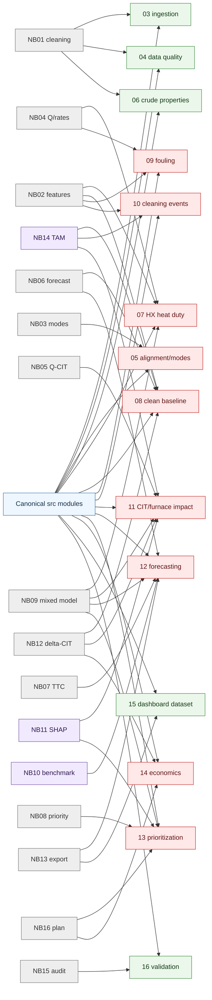
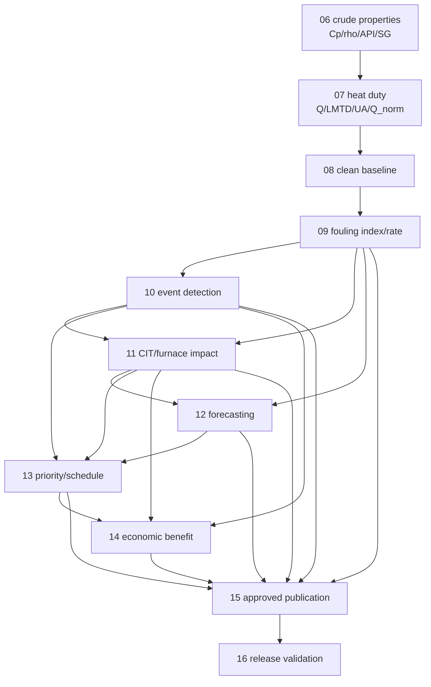
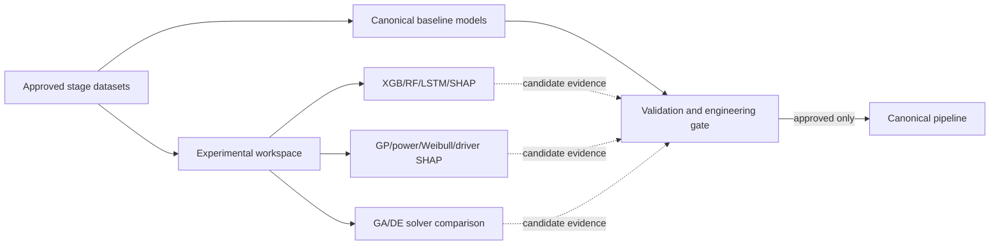
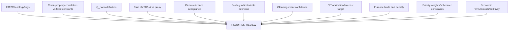

# Proposed Clean Dependency Graph

## Legacy consolidation into canonical stages

## Canonical calculation ownership

No calculation is owned by Stage 15 or the dashboard. Stage 15 performs presentation joins and serialization only.

## Experimental separation

## Engineering-review blockers

## Safest migration order

```mermaid
flowchart LR
    A["1. Run context + schemas"] --> B["2. Approved tag/topology snapshot"]
    B --> C["3. Immutable ingestion"]
    C --> D["4. DQ flags"]
    D --> E["5. Operating modes"]
    E --> F["6. Crude properties + heat duty shadow tables"]
    F --> G["7. Compare against legacy without publishing"]
    G --> H["8. Engineering approval"]
    H --> I["9. Continue baseline/fouling/events"]
```

