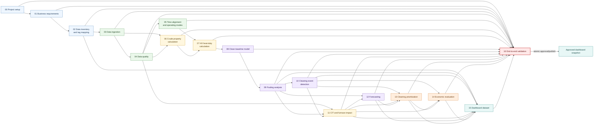
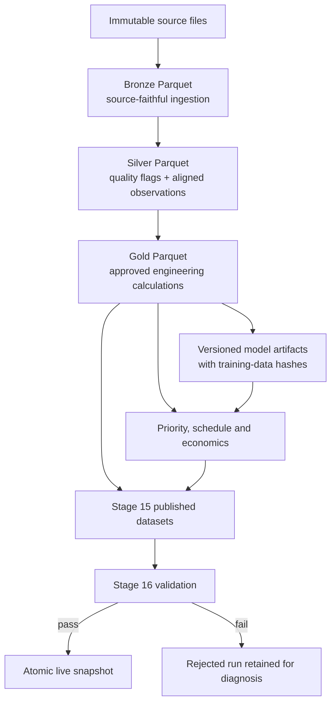
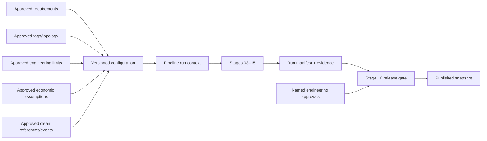
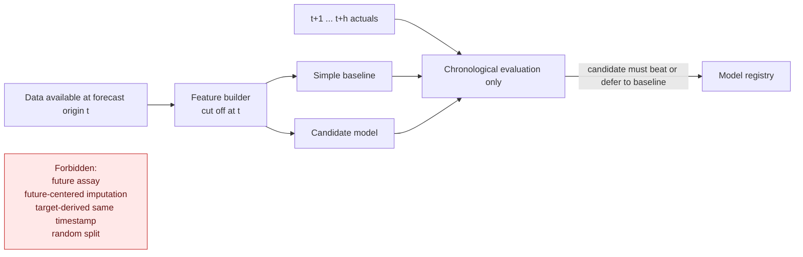
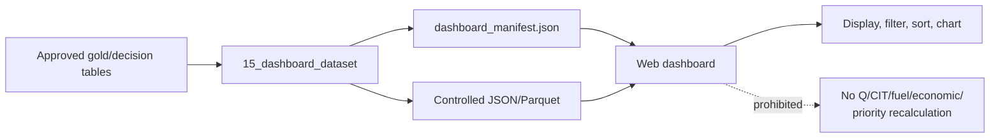
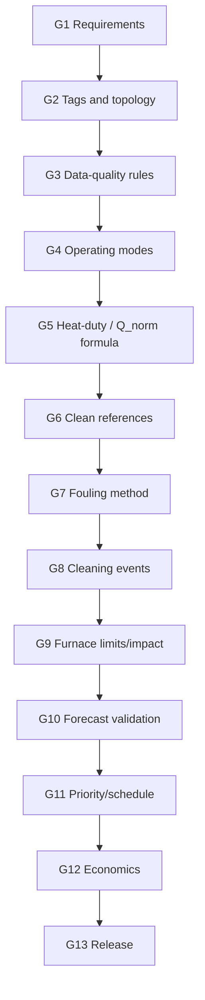

# Target Pipeline Graph

## Canonical stage flow

```mermaid
flowchart LR
    classDef setup fill:#eef6ff,stroke:#3973ac,color:#16324f
    classDef data fill:#eaf7ea,stroke:#3d8b40,color:#153d18
    classDef calc fill:#fff7df,stroke:#c68a00,color:#513800
    classDef model fill:#f1eaff,stroke:#7451a6,color:#2f1854
    classDef decision fill:#ffeede,stroke:#cf6f17,color:#633000
    classDef publish fill:#e8f7f6,stroke:#16847e,color:#0c413e
    classDef gate fill:#ffe8e8,stroke:#c62828,color:#641515,stroke-width:2px

    S00["00 Project setup"]:::setup
    S01["01 Business requirements"]:::setup
    S02["02 Data inventory<br/>and tag mapping"]:::setup
    S03["03 Data ingestion"]:::data
    S04["04 Data quality"]:::data
    S05["05 Time alignment<br/>and operating modes"]:::data
    S06["06 Crude property<br/>calculation"]:::calc
    S07["07 HX heat-duty<br/>calculation"]:::calc
    S08["08 Clean-baseline model"]:::model
    S09["09 Fouling analysis"]:::model
    S10["10 Cleaning-event<br/>detection"]:::model
    S11["11 CIT and furnace impact"]:::calc
    S12["12 Forecasting"]:::model
    S13["13 Cleaning prioritization"]:::decision
    S14["14 Economic evaluation"]:::decision
    S15["15 Dashboard dataset"]:::publish
    S16["16 End-to-end validation"]:::gate
    DASH["Approved dashboard snapshot"]:::publish

    S00 --> S01 --> S02 --> S03 --> S04 --> S05
    S03 --> S06
    S04 --> S06
    S05 --> S07
    S06 --> S07
    S07 --> S08 --> S09 --> S10
    S04 --> S11
    S09 --> S11
    S10 --> S11
    S09 --> S12
    S11 --> S12
    S10 --> S13
    S11 --> S13
    S12 --> S13
    S10 --> S14
    S11 --> S14
    S13 --> S14
    S02 --> S15
    S09 --> S15
    S10 --> S15
    S11 --> S15
    S12 --> S15
    S13 --> S15
    S14 --> S15
    S00 --> S16
    S01 --> S16
    S02 --> S16
    S03 --> S16
    S04 --> S16
    S05 --> S16
    S06 --> S16
    S07 --> S16
    S08 --> S16
    S09 --> S16
    S10 --> S16
    S11 --> S16
    S12 --> S16
    S13 --> S16
    S14 --> S16
    S15 --> S16
    S16 -->|"atomic approval/publish"| DASH
```

## Data-zone flow

```mermaid
flowchart TB
    RAW["Immutable source files"] --> BRONZE["Bronze Parquet<br/>source-faithful ingestion"]
    BRONZE --> SILVER["Silver Parquet<br/>quality flags + aligned observations"]
    SILVER --> GOLD["Gold Parquet<br/>approved engineering calculations"]
    GOLD --> MODEL["Versioned model artifacts<br/>with training-data hashes"]
    GOLD --> DECISION["Priority, schedule and economics"]
    MODEL --> DECISION
    GOLD --> PUBLISH["Stage 15 published datasets"]
    DECISION --> PUBLISH
    PUBLISH --> VALIDATE["Stage 16 validation"]
    VALIDATE -->|"pass"| LIVE["Atomic live snapshot"]
    VALIDATE -->|"fail"| REJECT["Rejected run retained for diagnosis"]
```

## Configuration and approval flow

```mermaid
flowchart LR
    REQ["Approved requirements"] --> CFG["Versioned configuration"]
    TAG["Approved tags/topology"] --> CFG
    LIM["Approved engineering limits"] --> CFG
    ECON["Approved economic assumptions"] --> CFG
    CLEAN["Approved clean references/events"] --> CFG

    CFG --> RUN["Pipeline run context"]
    RUN --> STAGES["Stages 03–15"]
    STAGES --> MAN["Run manifest + evidence"]
    MAN --> GATE["Stage 16 release gate"]
    APPROVAL["Named engineering approvals"] --> GATE
    GATE --> SNAP["Published snapshot"]
```

## Leakage-safe forecasting boundary

```mermaid
flowchart LR
    HIST["Data available at forecast origin t"] --> FEAT["Feature builder<br/>cut off at t"]
    FEAT --> BASE["Simple baseline"]
    FEAT --> MODEL["Candidate model"]
    FUTURE["t+1 ... t+h actuals"] --> EVAL["Chronological evaluation only"]
    BASE --> EVAL
    MODEL --> EVAL
    EVAL -->|"candidate must beat or defer to baseline"| REG["Model registry"]

    classDef forbidden fill:#ffe8e8,stroke:#c62828,color:#641515
    LEAK["Forbidden:<br/>future assay<br/>future-centered imputation<br/>target-derived same timestamp<br/>random split"]:::forbidden
```

## Dashboard boundary

```mermaid
flowchart LR
    GOLD["Approved gold/decision tables"] --> PUB["15_dashboard_dataset"]
    PUB --> MAN["dashboard_manifest.json"]
    PUB --> JSON["Controlled JSON/Parquet"]
    MAN --> UI["Web dashboard"]
    JSON --> UI

    UI --> DISPLAY["Display, filter, sort, chart"]
    UI -. prohibited .-> CALC["No Q/CIT/fuel/economic/<br/>priority recalculation"]
```

## Stage approval gates

```mermaid
flowchart TB
    G1["G1 Requirements"] --> G2["G2 Tags and topology"]
    G2 --> G3["G3 Data-quality rules"]
    G3 --> G4["G4 Operating modes"]
    G4 --> G5["G5 Heat-duty / Q_norm formula"]
    G5 --> G6["G6 Clean references"]
    G6 --> G7["G7 Fouling method"]
    G7 --> G8["G8 Cleaning events"]
    G8 --> G9["G9 Furnace limits/impact"]
    G9 --> G10["G10 Forecast validation"]
    G10 --> G11["G11 Priority/schedule"]
    G11 --> G12["G12 Economics"]
    G12 --> G13["G13 Release"]
```

